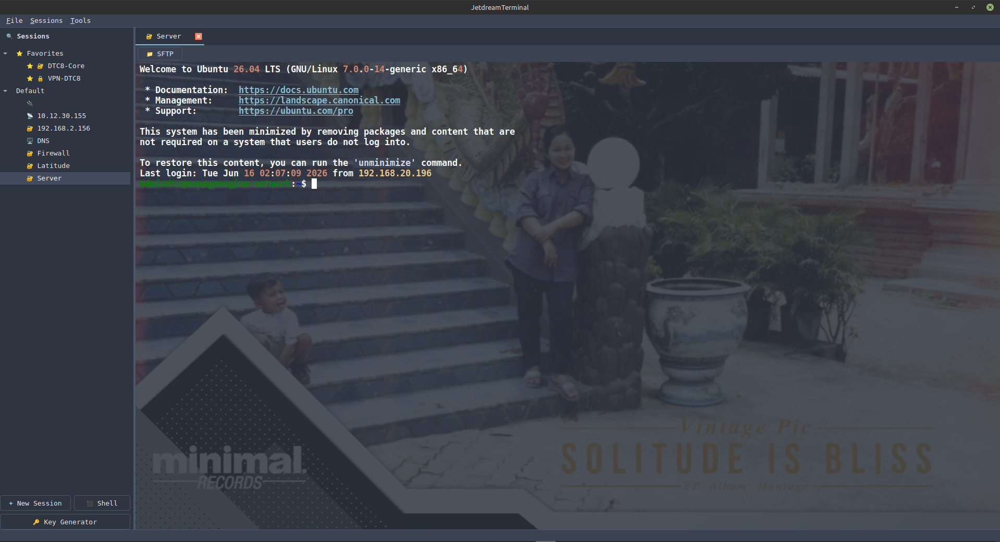

# JetdreamTerminal

PyQt6 terminal client สำหรับ Linux — MobaXterm clone ที่รองรับ SSH, Telnet, RDP, Serial, SFTP, VPN, VNC และ Local Shell

## Features

- **SSH** — Standard + Legacy mode สำหรับ Cisco/Aruba older devices + Windows SSH
- **Telnet** — Console server, legacy network devices
- **RDP** — xfreerdp subprocess
- **SFTP** — File browser panel ทั้งแบบ standalone และ inline ใน SSH tab (รองรับ Windows paths)
- **Serial** — Console cable / USB-to-Serial adapter พร้อม auto-detect ports
- **VPN** — openfortivpn (SSL VPN)
- **VNC** — vncviewer/remmina subprocess
- **Shell** — Local terminal (bash/zsh/fish)

### Terminal

- พื้นหลังรูปภาพ + ปรับความโปร่งใสได้
- Dracula theme (default)
- Bold font สำหรับตัวหนังสือที่ชัดเจน
- Thai text + combining characters support
- Scrollback 5000+ บรรทัด
- Mouse selection + auto-copy
- PageUp/PageDown scrolling
- Keyboard shortcuts: Ctrl+Shift+C/V, Ctrl+A/E/K/U/W

### SSH Legacy Mode

รองรับ Cisco 2960X, 3750, ASA 5500, Aruba switches ที่ใช้ SSH algorithms เก่า:
- KexAlgorithms: diffie-hellman-group1-sha1, diffie-hellman-group14-sha1
- HostKeyAlgorithms: ssh-rsa, ssh-dss
- Ciphers: aes128-cbc, 3des-cbc
- MACs: hmac-md5, hmac-sha1

### Windows SSH/SFTP

รองรับ SSH ไปเครื่อง Windows (OpenSSH on Windows Server / Windows 10+):
- Auto-detect Windows hostnames (WIN-*, DESKTOP-*, DC-*, etc.)
- SFTP path resolution: `%USERPROFILE%` → `$HOME`
- Path separators normalized to `/`

### VNC

รองรับ VNC ผ่าน vncviewer (tigervnc) หรือ remmina:
- TigerVNC ใช้ `host::port` (double colon) สำหรับ explicit port
- Password file เป็น binary format (8 bytes XOR-encrypted)

## Screenshots

<p align="center">
  
</p>

## Requirements

### Python packages

```
PyQt6>=6.6.0
paramiko>=3.4.0
cryptography>=42.0.0
pyte>=0.8.0
pyserial>=3.5
```

### System packages

```bash
sudo apt install python3-venv libxcb-cursor0 libxcb-xinerama0 libxcb-icccm4 \
    libxcb-image0 libxcb-keysyms1 libxcb-render-util0 libxcb-shape0 \
    libxkbcommon-x11-0 sshpass freerdp2-x11 tigervnc-viewer
```

> Ubuntu 24.04+: ใช้ `freerdp3-x11` แทน `freerdp2-x11`
> `install.sh` จะ detect version ให้อัตโนมัติ

## Installation

### Prerequisites

```bash
sudo apt install python3-venv libxcb-cursor0 libxcb-xinerama0 libxcb-icccm4 \
    libxcb-image0 libxcb-keysyms1 libxcb-render-util0 libxcb-shape0 \
    libxkbcommon-x11-0 sshpass freerdp2-x11 tigervnc-viewer
```

### Install as Application (Recommended)

```bash
git clone https://github.com/phattharathornPN/JetdreamTerminal.git
cd JetdreamTerminal
sudo ./install.sh
```

`install.sh` จะ:
- สร้าง virtual environment + ติดตั้ง Python packages อัตโนมัติ
- ติดตั้ง desktop entry + icon ใน Applications menu
- สร้าง shortcut บน Desktop
- สร้าง symlink ไปที่ `/usr/local/bin/jetdreamterminal`

### Run directly (without install)

```bash
git clone https://github.com/phattharathornPN/JetdreamTerminal.git
cd JetdreamTerminal

python3 -m venv .venv
source .venv/bin/activate
pip install -r requirements.txt

python3 main.py
```

## Usage

### Run

```bash
# If installed via install.sh
jetdreamterminal

# Or run directly
./launch.sh
```

หรือ

```bash
source .venv/bin/activate
python3 main.py
```

### Create SSH Session

1. กด **+ New Session**
2. เลือก Type: **SSH**
3. กรอก Host, Port, Username
4. เลือก Auth Type: Password หรือ Key
5. ติ๊ก **Legacy Mode** สำหรับ Cisco/Aruba older devices
6. กด Save → Double-click session เพื่อ connect

### Create VNC Session

1. กด **+ New Session**
2. เลือก Type: **VNC**
3. กรอก Host, Port (default: 5901)
4. กด Save → Double-click session
5. กด **Connect** → vncviewer จะถาม password

### Serial Console

1. กด **+ New Session**
2. เลือก Type: **Serial**
3. เลือก Port (auto-detect `/dev/ttyUSB0`, `/dev/ttyACM0`)
4. เลือก Baudrate (default: 9600)
5. กด Save → Auto-connect เมื่อเปิด tab

### SFTP

ใน SSH tab กดปุ่ม **SFTP** เพื่อเปิด file browser panel

### Settings

ไปที่ **Tools → Settings** หรือกด **Ctrl+,**
- Background Image — เลือกรูปพื้นหลัง
- Background Opacity — ปรับความโปร่งใส 10%-100%

## Keyboard Shortcuts

| Shortcut | Action |
|---|---|
| `Ctrl+N` | New Session |
| `Ctrl+Q` | Quit |
| `Ctrl+K` | SSH Key Generator |
| `Ctrl+,` | Settings |
| `Ctrl+Shift+C` | Copy |
| `Ctrl+Shift+V` | Paste |
| `Ctrl+C` | SIGINT (send to process) |
| `Ctrl+A` | Move to beginning of line |
| `Ctrl+E` | Move to end of line |
| `Ctrl+K` | Kill to end of line |
| `Ctrl+U` | Kill to beginning of line |
| `Ctrl+W` | Delete word |
| `PageUp/PageDown` | Scroll one page |
| `Shift+Tab` | Backtab (send `\x1b[Z`) |

## Config Paths

| File | Path |
|---|---|
| App config | `~/.config/jetdreamterminal/config.ini` |
| Encryption key | `~/.config/jetdreamterminal/key.bin` |
| Database | `~/.local/share/jetdreamterminal/sessions.db` |
| Logs | `~/.local/share/jetdreamterminal/app.log` |

## Architecture

```
JetdreamTerminal/
├── main.py                 ← Entry point
├── core/
│   ├── pty_manager.py      ← PTY fork, QSocketNotifier, resize
│   ├── ssh_client.py       ← SSH command builder (standard + legacy + Windows)
│   ├── rdp_client.py       ← xfreerdp subprocess wrapper
│   ├── vnc_client.py       ← vncviewer/remmina subprocess wrapper
│   ├── serial_client.py    ← pyserial + QTimer polling
│   ├── sftp_browser.py     ← paramiko Transport SFTP (Windows paths)
│   ├── crypto.py           ← Fernet encrypt/decrypt
│   ├── session_manager.py  ← SQLite CRUD
│   └── host_key.py         ← ssh-keyscan + TOFU
├── ui/
│   ├── main_window.py      ← MainWindow, sidebar, tabs, menus
│   ├── terminal_widget.py  ← pyte + QPainter + scroll + selection
│   ├── session_dialog.py   ← New/Edit session dialog
│   ├── ssh_tab.py          ← SSH tab with SFTP panel
│   ├── vnc_tab.py          ← VNC tab (host + port)
│   ├── vpn_tab.py          ← VPN tab (openfortivpn)
│   ├── settings_dialog.py  ← Settings: bg image, opacity
│   ├── highlight.py        ← Regex syntax highlighting
│   └── theme.py            ← Dracula theme + QSS
├── models/
│   └── session.py          ← Session dataclass + enums
└── utils/
    ├── db.py               ← SQLite connection + schema
    ├── config.py           ← paths + config load/save
    └── logger.py           ← file + console logging
```

## Tech Stack

| Layer | Library |
|---|---|
| GUI | PyQt6 |
| Terminal emulation | pyte |
| PTY | python-pty (stdlib) |
| Async read | QSocketNotifier |
| SSH/SFTP | paramiko |
| Serial | pyserial |
| Crypto | cryptography (Fernet) |
| RDP | xfreerdp (system) |
| VNC | vncviewer/remmina (system) |
| VPN | openfortivpn (system) |
| Storage | SQLite |

## Known Issues

- SFTP ใช้ `paramiko.Transport` ตรง (ไม่ใช้ SSHClient) เพราะ paramiko 5.0.0 มีปัญหา "No existing session"
- Legacy SSH mode สำคัญมากสำหรับ work ที่ใช้ Cisco/Aruba older devices
- VNC password file ต้องเป็น binary format (XOR) ไม่ใช่ plain text

## License

MIT
